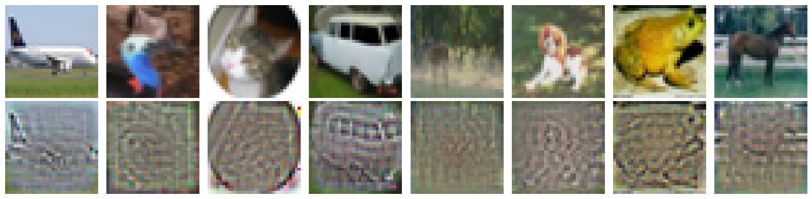

# Distilled Replay with Distribution Matching

 

Code used for the experiments conducted on the paper [Continual Learning: Comparison and New Strategies Based on Dataset Distillation](https://github.com/Jaruba20/Distilled-Replay-DMatch/blob/master/CL%20Comparison%20and%20New%20Strats%20based%20on%20DD.pdf)

The model, scifar10_exp and sminst_exp folders are a modified version of the Distilled Replay implementation available at https://github.com/andrearosasco/DistilledReplay
of the paper https://arxiv.org/pdf/2103.15851.

The modified approach, achieves **equal** (SplitMNIST) or **better** (SplitCIFAR10) average accuracies than the original method while **reducing computing time in almost 50%**. 

